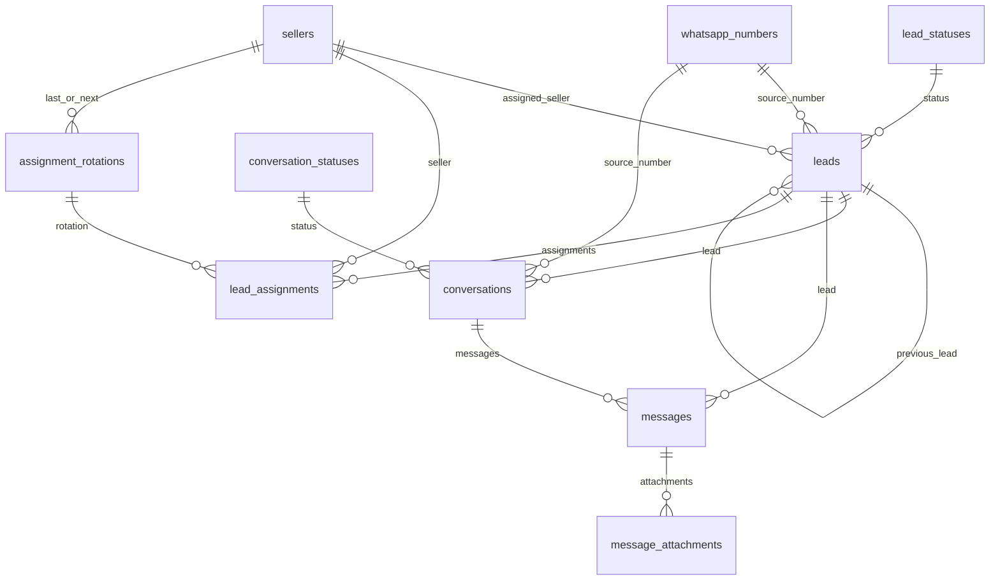

# Esquema Inicial

## Objetivo

Documentar la estructura inicial de la base de datos ya implementada como migraciones versionadas.

## Convenciones

- tablas y columnas en ingles con `snake_case`
- estados catalogados con `code` tecnico en ingles y `label` visible en espanol
- auditoria general en una sola tabla
- soporte para borrado logico mediante `deleted_at`

## Entidades principales

- `whatsapp_numbers`: numeros propios del negocio que reciben mensajes
- `leads`: oportunidades comerciales historicas
- `conversations`: hilos conversacionales separados del lead
- `messages`: mensajes entrantes y salientes con payload crudo
- `message_attachments`: metadatos de adjuntos
- `sellers`: vendedores elegibles para asignacion
- `assignment_rotations`: puntero persistente del round robin
- `lead_assignments`: historial de asignaciones e intentos
- `lead_statuses`: catalogo de estados del lead
- `conversation_statuses`: catalogo de estados de conversacion
- `audit_logs`: auditoria funcional y tecnica

## Relacion general

## Orden de migraciones

1. `001_create_status_catalogs.sql`
2. `002_create_operational_tables.sql`
3. `003_create_indexes.sql`

## Seeds iniciales

- `001_lead_statuses.sql`
- `002_conversation_statuses.sql`

## Notas operativas

- La base queda preparada para multiples numeros de WhatsApp.
- Un mismo telefono puede tener multiples leads a lo largo del tiempo.
- Una conversacion puede existir antes de que el lead se cree en ClickUp.
- Los adjuntos se registran como metadata, no como binario.

