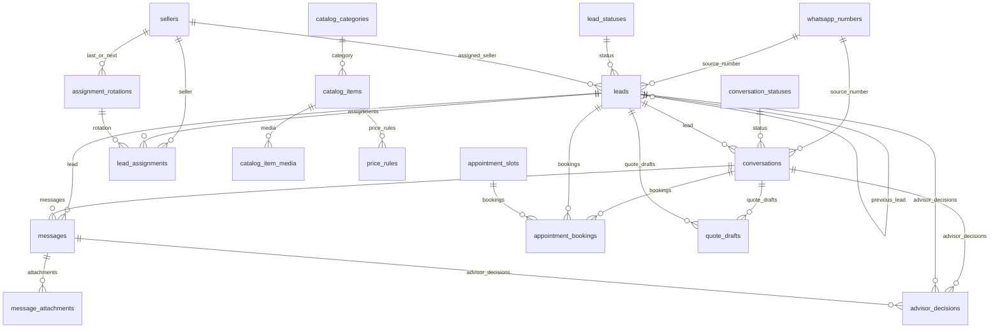

# Esquema Inicial

## Objetivo

Documentar la estructura inicial de la base de datos ya implementada como migraciones versionadas.

## Convenciones

- tablas y columnas en ingles con `snake_case`
- estados catalogados con `code` tecnico en ingles y `label` visible en espanol
- auditoria general en una sola tabla
- soporte para borrado logico mediante `deleted_at`

## Entidades principales

- `whatsapp_numbers`: numeros propios del negocio que reciben mensajes
- `leads`: oportunidades comerciales historicas
- `conversations`: hilos conversacionales separados del lead
- `messages`: mensajes entrantes y salientes con payload crudo
- `message_attachments`: metadatos de adjuntos
- `sellers`: vendedores elegibles para asignacion
- `assignment_rotations`: puntero persistente del round robin
- `lead_assignments`: historial de asignaciones e intentos
- `lead_statuses`: catalogo de estados del lead
- `conversation_statuses`: catalogo de estados de conversacion
- `audit_logs`: auditoria funcional y tecnica
- `catalog_categories`: categorias comerciales para el asesor AI
- `catalog_items`: productos y servicios recomendables
- `catalog_item_media`: medios y links asociados al catalogo
- `commercial_conditions`: condiciones comerciales aprobadas
- `price_rules`: reglas de precio y cotizacion referencial
- `faq_entries`: preguntas frecuentes aprobadas
- `objection_playbooks`: guias para responder objeciones
- `appointment_slots`: disponibilidad de llamadas, visitas u otras citas
- `appointment_bookings`: reservas o solicitudes de agenda
- `quote_drafts`: cotizaciones preliminares
- `advisor_decisions`: decisiones AI auditables

## Relacion general

## Orden de migraciones

1. `001_create_status_catalogs.sql`
2. `002_create_operational_tables.sql`
3. `003_create_indexes.sql`
4. `004_create_commercial_advisor_tables.sql`

## Seeds iniciales

- `001_lead_statuses.sql`
- `002_conversation_statuses.sql`
- `005_commercial_advisor.example.sql` como plantilla para datos comerciales privados

## Notas operativas

- La base queda preparada para multiples numeros de WhatsApp.
- Un mismo telefono puede tener multiples leads a lo largo del tiempo.
- Una conversacion puede existir antes de que el lead se cree en ClickUp.
- Los adjuntos se registran como metadata, no como binario.
- Un vendedor notificable debe cumplir: `deleted_at IS NULL`, `is_active = TRUE` y `clickup_user_id` no vacio.
- El round robin operativo solo debe considerar vendedores notificables; si no existe ninguno, el flujo registra fallo `no_notifiable_seller`.
- El esquema actual no tiene una marca formal de ambiente o dato de prueba. Antes de reportar metricas comerciales, excluir los leads de validacion documentados o agregar una marca formal en una fase posterior.
- Las tablas comerciales habilitan la evolucion a asesor AI, pero no autorizan por si solas a informar precio final o confirmar agenda. El workflow debe validar fuente oficial, vigencia y confirmacion antes de cerrar compromisos.
