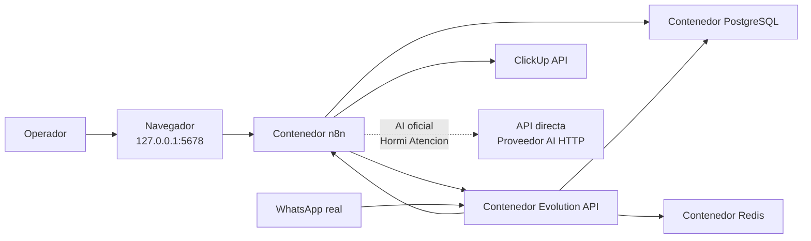
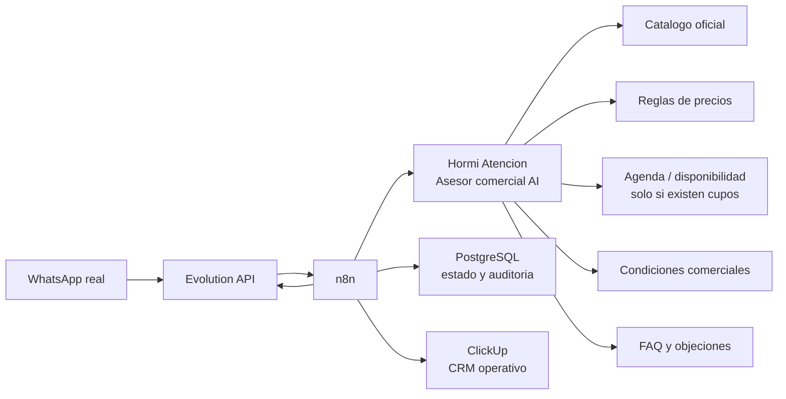

# Arquitectura

## Objetivo

Documentar la arquitectura tecnica del proyecto de automatizacion de leads por WhatsApp.

## Alcance de este documento

Este documento describira la arquitectura objetivo del sistema, incluyendo:

- componentes principales
- responsabilidades de `n8n`
- responsabilidades de `PostgreSQL`
- integraciones externas
- preparacion para escalado futuro

## Estado actual

La arquitectura local ya fue implementada y validada funcionalmente con mensajes reales de WhatsApp hasta creacion de tareas en ClickUp.

## Componentes implementados

- `n8n` como orquestador de workflows e integraciones
- `PostgreSQL` como persistencia y fuente de verdad del estado
- `Evolution API` como canal self-hosted de entrada y salida de WhatsApp
- `Redis` como dependencia operativa de `Evolution API`
- ClickUp como CRM operativo de leads
- ClickUp como canal interno inicial de notificacion al vendedor
- API directa como proveedor AI oficial para el rol conversacional `Hormi Atencion`

## Asesor comercial AI implementado

`Hormi Atencion` opera como asesor comercial AI para WhatsApp. Gemini conduce la conversacion; `n8n` valida estado, guardrails y acciones; PostgreSQL conserva memoria y auditoria.

Capacidades actuales:

- recomendar productos o servicios desde un catalogo oficial
- responder preguntas frecuentes con condiciones comerciales aprobadas
- orientar precios cuando existan reglas oficiales
- capturar solicitudes de agenda sin prometer cupos inexistentes
- manejar objeciones simples de precio, plazo, confianza o comparacion
- cerrar el siguiente paso comercial con confirmacion explicita
- derivar a vendedor con resumen, contexto, objeciones y condiciones ya informadas

La AI no debe inventar precios, stock, descuentos, plazos, cupos de agenda ni condiciones. `n8n` debe validar la salida AI antes de ejecutar persistencia, ClickUp, agenda o notificaciones.

Estado actual de fuentes comerciales:

- catalogo publico Hormiglass cargado
- 28 productos/servicios activos
- 28 reglas de precio publicas activas
- 8 condiciones comerciales activas
- 12 FAQ activas
- 5 playbooks de objeciones activos
- agenda sin cupos activos; no se ofrecen horarios
- workflow AI conectado al contexto comercial versionado antes de llamar al proveedor
- memoria persistente mediante `qualification_context JSONB`
- pregunta contextual persistente mediante `pending_question_key`

## Topologia local actual

## Topologia actual del asesor comercial

Esta topologia esta implementada. La agenda permanece deshabilitada funcionalmente mientras no existan cupos reales.

## Integridad del dispatcher y despliegue

El dispatcher usa un contrato terminal de un item: `should_send_handoff`,
`message` y `lead_id`. La salida persistida de CRM prevalece al combinar contexto;
por eso el texto de handoff confirma asignacion solo cuando existe una asignacion
persistida, y ambas ramas alcanzan la finalizacion del inbox.

Los IDs runtime no se versionan. `n8n/workflow-links.json` declara enlaces por
nombre y `scripts/dev/sync-n8n-workflows.sh` aplica este gate:

1. preflight y resolucion unica de identidades;
2. snapshot y pausa de Entry/Recovery;
3. importacion con enlaces resueltos;
4. exportacion y comparacion logica completa contra el candidato;
5. aislamiento de Evolution y E2E/replay sobre activacion temporal controlada;
6. activacion definitiva, reverificacion remota y readiness del webhook.

Ante un fallo, el snapshot completo se restaura y verifica con el trafico pausado.
La reanudacion requiere redeploy verificado y acceptance E2E exitoso.

## Decisiones tecnicas implementadas en esta fase

- `n8n` y `PostgreSQL` corren en contenedores Docker, sin instalacion nativa en macOS.
- `Evolution API` y `Redis` se agregan como servicios locales del stack.
- el `docker-compose.yml` actual publica puertos en `0.0.0.0` para operacion local simple; en staging/produccion debe restringirse con firewall, reverse proxy y redes privadas
- la persistencia usa volumenes nombrados de Docker
- `PostgreSQL` expone `5433` localmente para facilitar inspeccion futura
- `n8n` usa `PostgreSQL` como base principal desde el inicio
- `Evolution API` usa una base separada dentro del mismo servidor PostgreSQL
- `infra/postgres/init/` queda montado para scripts iniciales si luego se usan
- el webhook versionado en `.env.example` usa la red interna de Docker con `http://n8n:5678/...`; `host.docker.internal` queda como alternativa cuando se necesite llamar al puerto publicado del host
- ClickUp ya fue integrado con creacion de tareas, comentario conversacional completo y notificacion inicial al vendedor
- la capa AI oficial es Hormi Atencion con Gemini por API directa: conversa, orienta, extrae datos, decide la siguiente pregunta y solicita confirmacion
- `qualification_context` conserva medidas, modalidad, terreno, acceso, escombros, urgencia, cliente, D.A.T.O.S. y resumen ejecutivo
- `pending_question_key` contextualiza respuestas breves y evita reinicios accidentales
- el mensaje de derivacion nace del resultado exitoso del CRM, no de una promesa anticipada de la AI
- `n8n` y PostgreSQL conservan la ejecucion del estado: la AI no escribe directo en PostgreSQL, no crea tareas ClickUp por fuera del workflow y no asigna vendedores por fuera del round robin
- la evolucion hacia asesor comercial AI debe mantener la misma separacion: la AI recomienda y conversa; `n8n` valida y ejecuta; PostgreSQL registra trazabilidad; ClickUp recibe el resultado comercial
- los secretos reales de AI, ClickUp y Evolution quedan fuera de Git; solo el integrador debe usarlos para pruebas reales
- la configuracion operativa de AI directa vive en `docs/ai-api-directa-configuracion.md`
- el diseno funcional y tecnico del asesor comercial AI vive en `docs/asesor-comercial-ai.md`
- la exposicion publica de webhooks no se implementa todavia; antes de abrir trafico real deben quedar cerrados proxy, HTTPS, firewall y secreto del webhook

## Autenticacion de n8n

En versiones actuales de `n8n`, el acceso inicial queda protegido por el flujo de creacion del usuario propietario en el primer arranque. En esta base local no se implementa autenticacion basica antigua.

## Pendientes reales

- ampliar la matriz real a B2B, reclamos, garantia, pagos y consultas de stock
- definir fuente oficial de agenda antes de habilitar horarios
- integrar inventario antes de confirmar disponibilidad
- integrar Finanzas antes de confirmar pagos
- validar restore completo en entorno aislado si se requiere recuperacion total
- documentar estrategia operativa de multiples instancias en `Evolution API`
