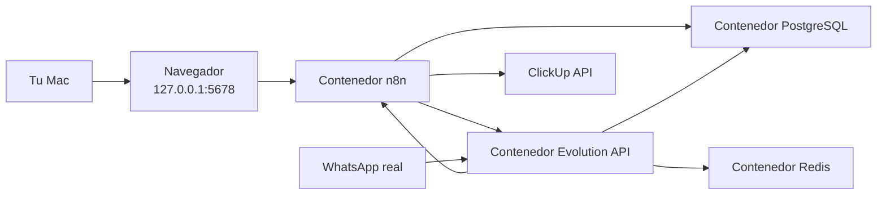

# Arquitectura

## Objetivo

Documentar la arquitectura tecnica del proyecto de automatizacion de leads por WhatsApp.

## Alcance de este documento

Este documento describira la arquitectura objetivo del sistema, incluyendo:

- componentes principales
- responsabilidades de `n8n`
- responsabilidades de `PostgreSQL`
- integraciones externas
- preparacion para escalado futuro

## Estado actual

La arquitectura local ya fue implementada y validada funcionalmente con mensajes reales de WhatsApp hasta creacion de tareas en ClickUp.

## Componentes implementados

- `n8n` como orquestador de workflows e integraciones
- `PostgreSQL` como persistencia y fuente de verdad del estado
- `Evolution API` como canal self-hosted de entrada y salida de WhatsApp
- `Redis` como dependencia operativa de `Evolution API`
- ClickUp como CRM operativo de leads
- ClickUp como canal interno inicial de notificacion al vendedor

## Topologia local actual

## Decisiones tecnicas implementadas en esta fase

- `n8n` y `PostgreSQL` corren en contenedores Docker, sin instalacion nativa en macOS.
- `Evolution API` y `Redis` se agregan como servicios locales del stack.
- ambos servicios publican puertos solo en `127.0.0.1`
- la persistencia usa volumenes nombrados de Docker
- `PostgreSQL` expone `5433` localmente para facilitar inspeccion futura
- `n8n` usa `PostgreSQL` como base principal desde el inicio
- `Evolution API` usa una base separada dentro del mismo servidor PostgreSQL
- `infra/postgres/init/` queda montado para scripts iniciales si luego se usan
- el webhook actual funciona localmente desde `Evolution API` hacia `n8n` usando `host.docker.internal`
- ClickUp ya fue integrado con creacion de tareas, comentario conversacional completo y notificacion inicial al vendedor
- la exposicion publica de webhooks no se implementa todavia; el entorno actual sigue pensado para operacion local controlada

## Autenticacion de n8n

En versiones actuales de `n8n`, el acceso inicial queda protegido por el flujo de creacion del usuario propietario en el primer arranque. En esta base local no se implementa autenticacion basica antigua.

## Pendientes

- probar restore de PostgreSQL y volumen de `n8n`
- validar `OPS - Error Handler` con un fallo controlado
- documentar estrategia operativa de multiples instancias en `Evolution API`
