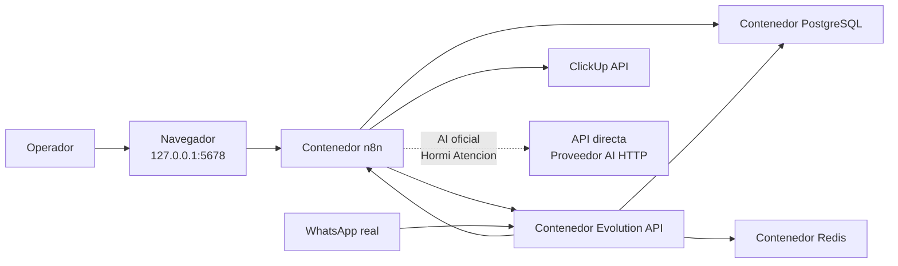
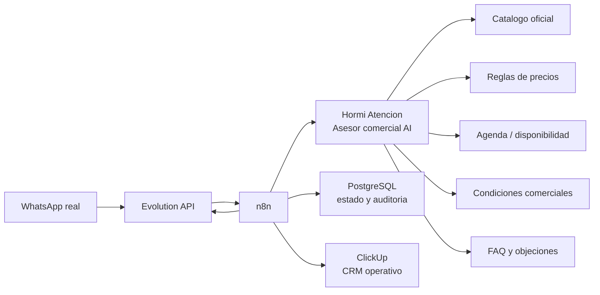

# Arquitectura

## Objetivo

Documentar la arquitectura tecnica del proyecto de automatizacion de leads por WhatsApp.

## Alcance de este documento

Este documento describira la arquitectura objetivo del sistema, incluyendo:

- componentes principales
- responsabilidades de `n8n`
- responsabilidades de `PostgreSQL`
- integraciones externas
- preparacion para escalado futuro

## Estado actual

La arquitectura local ya fue implementada y validada funcionalmente con mensajes reales de WhatsApp hasta creacion de tareas en ClickUp.

## Componentes implementados

- `n8n` como orquestador de workflows e integraciones
- `PostgreSQL` como persistencia y fuente de verdad del estado
- `Evolution API` como canal self-hosted de entrada y salida de WhatsApp
- `Redis` como dependencia operativa de `Evolution API`
- ClickUp como CRM operativo de leads
- ClickUp como canal interno inicial de notificacion al vendedor
- API directa como proveedor AI oficial para el rol conversacional `Hormi Atencion`

## Evolucion objetivo: asesor comercial AI

El nuevo rumbo funcional del proyecto es convertir `Hormi Atencion` en un asesor comercial AI para WhatsApp. Esta evolucion no reemplaza los controles actuales: los amplia con fuentes oficiales de negocio.

Capacidades objetivo:

- recomendar productos o servicios desde un catalogo oficial
- responder preguntas frecuentes con condiciones comerciales aprobadas
- orientar precios cuando existan reglas oficiales
- ofrecer o solicitar agenda cuando exista disponibilidad real
- manejar objeciones simples de precio, plazo, confianza o comparacion
- cerrar el siguiente paso comercial con confirmacion explicita
- derivar a vendedor con resumen, contexto, objeciones y condiciones ya informadas

La AI no debe inventar precios, stock, descuentos, plazos, cupos de agenda ni condiciones. `n8n` debe validar la salida AI antes de ejecutar persistencia, ClickUp, agenda o notificaciones.

## Topologia local actual

## Topologia objetivo del asesor comercial

Esta topologia es objetivo. Las fuentes oficiales de catalogo, precios, agenda y condiciones aun deben definirse e implementarse.

## Decisiones tecnicas implementadas en esta fase

- `n8n` y `PostgreSQL` corren en contenedores Docker, sin instalacion nativa en macOS.
- `Evolution API` y `Redis` se agregan como servicios locales del stack.
- el `docker-compose.yml` actual publica puertos en `0.0.0.0` para operacion local simple; en staging/produccion debe restringirse con firewall, reverse proxy y redes privadas
- la persistencia usa volumenes nombrados de Docker
- `PostgreSQL` expone `5433` localmente para facilitar inspeccion futura
- `n8n` usa `PostgreSQL` como base principal desde el inicio
- `Evolution API` usa una base separada dentro del mismo servidor PostgreSQL
- `infra/postgres/init/` queda montado para scripts iniciales si luego se usan
- el webhook versionado en `.env.example` usa la red interna de Docker con `http://n8n:5678/...`; `host.docker.internal` queda como alternativa cuando se necesite llamar al puerto publicado del host
- ClickUp ya fue integrado con creacion de tareas, comentario conversacional completo y notificacion inicial al vendedor
- la capa AI oficial es Hormi Atencion en API directa: puede extraer datos, responder, pedir confirmacion y habilitar la creacion de lead cuando el usuario confirma
- `n8n` y PostgreSQL conservan la ejecucion del estado: la AI no escribe directo en PostgreSQL, no crea tareas ClickUp por fuera del workflow y no asigna vendedores por fuera del round robin
- la evolucion hacia asesor comercial AI debe mantener la misma separacion: la AI recomienda y conversa; `n8n` valida y ejecuta; PostgreSQL registra trazabilidad; ClickUp recibe el resultado comercial
- los secretos reales de AI, ClickUp y Evolution quedan fuera de Git; solo el integrador debe usarlos para pruebas reales
- la configuracion operativa de AI directa vive en `docs/ai-api-directa-configuracion.md`
- el diseno funcional y tecnico del asesor comercial AI vive en `docs/asesor-comercial-ai.md`
- la exposicion publica de webhooks no se implementa todavia; antes de abrir trafico real deben quedar cerrados proxy, HTTPS, firewall y secreto del webhook

## Autenticacion de n8n

En versiones actuales de `n8n`, el acceso inicial queda protegido por el flujo de creacion del usuario propietario en el primer arranque. En esta base local no se implementa autenticacion basica antigua.

## Pendientes

- validar matriz conversacional completa con AI apagada y AI encendida
- validar Hormi Atencion con servicios vivos desde el workspace del integrador
- ejecutar pruebas controladas con `AI_PROVIDER=direct_api`, `AI_DIRECT_API_KEY` y `AI_DIRECT_API_MODEL`
- definir fuente oficial de catalogo, precios, agenda, condiciones comerciales, FAQ y objeciones
- extender contrato AI para `sales_stage`, `buying_intent`, `urgency`, `price_context`, `agenda_context`, `next_best_action` y `handoff_reason`
- crear validaciones en `n8n` para que precios, agenda y condiciones provengan de fuentes oficiales antes de responder o cerrar
- validar restore completo en entorno aislado si se requiere recuperacion total
- documentar estrategia operativa de multiples instancias en `Evolution API`
