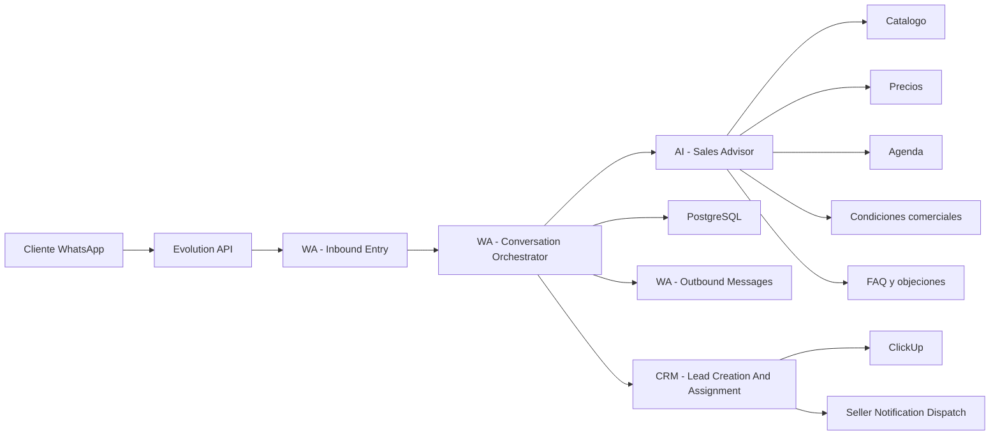

# Asesor Comercial AI

## Objetivo

Describir la implementacion vigente de `Hormi Atencion` como asesor comercial de WhatsApp capaz de guiar, recomendar, resolver dudas, manejar objeciones y cerrar el siguiente paso comercial con contexto real del negocio.

Gemini es la voz conversacional principal. `n8n` valida sus decisiones, mantiene memoria estructurada y ejecuta las operaciones en PostgreSQL, ClickUp y WhatsApp.

## Estado implementado

- modelo principal: `gemini-3.1-flash-lite`
- proveedor: Google mediante endpoint OpenAI-compatible
- memoria: `qualification_context` y `pending_question_key`
- contrato AI: actualizaciones de campos, pregunta respondida, siguiente pregunta, resumen de razonamiento, accion recomendada y texto de respuesta
- fuentes activas: 28 items de catalogo, 28 reglas de precio, 8 condiciones comerciales, 12 FAQ y 5 playbooks de objeciones
- handoff: solo se anuncia al cliente despues de crear y asignar el lead
- validacion E2E: flujo de instalacion en Vitacura, respuestas `no` contextuales, lead, asignacion y ClickUp

## Principio rector

La AI puede vender y asesorar, pero las reglas comerciales deben venir del sistema.

- La AI conversa, entiende, recomienda y redacta.
- Las fuentes oficiales entregan catalogo, precios, agenda y condiciones.
- `n8n` valida decisiones y ejecuta integraciones.
- PostgreSQL registra estado, evidencia y trazabilidad.
- ClickUp recibe oportunidades o cierres comerciales con contexto completo.

La AI no debe inventar precios, stock, descuentos, plazos, cupos de agenda ni condiciones comerciales.

## Alcance vigente

El asesor comercial debe poder:

- recibir y entender mensajes naturales por WhatsApp
- identificar necesidad, urgencia, presupuesto aproximado e intencion de compra
- recomendar productos o servicios del catalogo
- responder preguntas frecuentes con condiciones oficiales
- manejar objeciones simples como precio, plazo, confianza o comparacion
- cotizar de forma referencial cuando existan reglas de precio
- pedir datos faltantes para cotizacion o visita
- consultar disponibilidad de agenda cuando exista una fuente real
- proponer siguientes pasos concretos
- pedir confirmacion explicita antes de crear compromisos
- derivar al vendedor con resumen comercial completo

El cierre esperado puede ser uno de estos resultados:

- lead comercial confirmado
- cotizacion preliminar enviada
- visita o llamada agendada
- solicitud derivada a vendedor
- conversacion marcada como no calificada
- conversacion pausada esperando datos del cliente

## Limites no negociables

La AI no puede:

- crear leads sin confirmacion explicita cuando la regla comercial lo exige
- confirmar precio final si solo existe precio referencial
- prometer stock si no existe consulta de stock
- prometer agenda si no existe cupo bloqueado o confirmado
- aplicar descuentos no definidos por reglas comerciales
- escribir directo en PostgreSQL
- crear tareas en ClickUp fuera de los workflows
- asignar vendedores fuera del round robin o regla operativa definida
- ocultar al vendedor condiciones o promesas hechas al cliente

Si falta informacion oficial, la respuesta debe ser transparente:

- precio referencial sujeto a validacion
- disponibilidad por confirmar
- visita/cotizacion necesaria para cierre final
- derivacion a vendedor cuando el caso exceda la autonomia definida

## Fuentes oficiales necesarias

### Catalogo

Debe contener como minimo:

- id interno
- nombre comercial
- categoria
- descripcion breve para cliente
- servicios relacionados
- preguntas frecuentes asociadas
- restricciones o requisitos
- zonas o comunas aplicables, si corresponde
- imagenes, links o referencias, si existen
- estado activo/inactivo

### Precios

Debe contener como minimo:

- producto o servicio asociado
- tipo de precio: fijo, desde, rango, por unidad, por metro, por caso
- moneda
- vigencia
- condiciones de aplicacion
- reglas de calculo
- costos extra: despacho, instalacion, visita, urgencia
- margen de seguridad para respuesta referencial

La respuesta comercial debe distinguir entre:

- precio final
- precio referencial
- precio desde
- rango estimado
- requiere evaluacion

### Agenda

Debe contener como minimo:

- tipo de cita: llamada, visita, medicion, retiro, despacho
- disponibilidad real
- duracion
- zona/comuna cubierta
- responsable o equipo
- estado del cupo
- mecanismo de bloqueo o confirmacion

La AI solo puede ofrecer horarios que provengan de una fuente actualizada. Si no puede bloquear el cupo, debe decir que lo dejara solicitado o sujeto a confirmacion.

### Condiciones comerciales

Debe contener como minimo:

- formas de pago
- garantias
- plazos de entrega
- condiciones de instalacion
- politica de despacho
- cambios, devoluciones o anulaciones
- condiciones para cotizacion final
- reglas de descuento o promociones vigentes
- textos aprobados para respuestas sensibles

### Preguntas frecuentes y objeciones

Debe contener:

- dudas frecuentes
- respuestas aprobadas
- objeciones tipicas
- argumento recomendado
- cuando derivar a vendedor
- cuando pedir evidencia adicional, como medidas, fotos o direccion

## Arquitectura vigente



El workflow conserva el nombre tecnico `AI - Lead Qualification Assistant`, pero su responsabilidad funcional es la de `AI - Sales Advisor`.

## Contrato JSON vigente

La salida de la AI es estructurada y validable. Los campos conversacionales centrales son:

```json
{
  "intent": "quote_request",
  "sales_stage": "qualification",
  "buying_intent": "high",
  "urgency": "medium",
  "lead_quality": "qualified",
  "service": "Baldosas",
  "city": "Santiago",
  "requirement": "Renovar bano con baldosas antideslizantes",
  "missing_fields": ["measurements"],
  "catalog_matches": [
    {
      "id": "CAT-001",
      "name": "Baldosa antideslizante",
      "reason": "Aplica para bano y zonas humedas"
    }
  ],
  "price_context": {
    "type": "reference",
    "amount_min": 0,
    "amount_max": 0,
    "currency": "CLP",
    "requires_validation": true,
    "explanation": "Requiere medidas para cotizacion final"
  },
  "agenda_context": {
    "action": "offer_slots",
    "available_slots": [],
    "requires_confirmation": true
  },
  "objection_type": "none",
  "field_updates": {
    "measurements": "12 m2"
  },
  "answered_question_key": "measurements",
  "next_question_key": "terrain_type",
  "advisor_reasoning_summary": "El cliente entrego medidas; falta validar condiciones de instalacion.",
  "next_best_action": "ask_measurements",
  "should_create_lead": false,
  "should_schedule": false,
  "needs_human_handoff": false,
  "confidence": 0.86,
  "reply_text": "Perfecto, te puedo orientar. Para cotizar bien necesito las medidas aproximadas del bano o una foto del espacio.",
  "clickup_summary": "Cliente busca renovar bano en Santiago con baldosas antideslizantes. Falta medida para cotizacion.",
  "handoff_reason": ""
}
```

Campos de control recomendados:

- `sales_stage`: saludo, exploracion, calificacion, recomendacion, objecion, cotizacion, agenda, confirmacion, listo_para_ventas, no_calificado
- `next_best_action`: pedir_dato, recomendar_producto, responder_duda, manejar_objecion, cotizar_referencial, ofrecer_agenda, confirmar, derivar_vendedor, cerrar_no_calificado
- `price_context.type`: none, fixed, reference, from, range, formula, requires_human
- `agenda_context.action`: none, ask_preference, offer_slots, request_human_confirmation, booked

## Guardrails de validacion en n8n

Antes de ejecutar acciones, `n8n` debe validar:

- JSON parseable y esquema esperado
- `confidence` minimo para usar campos sugeridos
- catalogo encontrado antes de recomendar producto especifico
- precio con fuente oficial antes de informar monto
- agenda con cupo real antes de confirmar horario
- confirmacion explicita antes de crear lead, cotizacion formal o cita
- fallback deterministico si la AI falla, responde invalido o tiene baja confianza

Si alguna validacion falla, el workflow debe:

- responder con una pregunta segura
- pedir aclaracion
- derivar a vendedor
- usar el flujo deterministico existente

## Modelo de datos versionado

La migracion `infra/postgres/migrations/004_create_commercial_advisor_tables.sql` prepara estas tablas:

- `catalog_categories`
- `catalog_items`
- `catalog_item_media`
- `commercial_conditions`
- `price_rules`
- `faq_entries`
- `objection_playbooks`
- `appointment_slots`
- `appointment_bookings`
- `quote_drafts`
- `advisor_decisions`

Estas tablas son la base estructural. El catalogo publico Hormiglass y sus precios publicos ya tienen una primera carga versionada con 28 productos/servicios y 28 reglas de precio. `AI - Lead Qualification Assistant` ya carga ese contexto comercial antes de llamar al proveedor AI.

Condiciones comerciales, FAQ y objeciones ya tienen una carga inicial aprobada. La agenda permanece deshabilitada hasta contar con disponibilidad real y un mecanismo de reserva confiable.

## Plan de implementacion por fases

### Fase A. Base comercial estatica

Objetivo:

- dar a la AI contexto comercial aprobado sin permitir compromisos finales.

Incluye:

- definir catalogo inicial
- definir condiciones comerciales cuando exista informacion aprobada
- definir FAQ y objeciones cuando exista informacion aprobada
- extender prompt/contrato AI
- mantener agenda fuera del alcance operativo hasta tener fuente real

Criterio de salida:

- la AI recomienda y responde mejor
- no informa precios no definidos
- no agenda ni promete cupos

Estado actual:

- catalogo publico inicial cargado
- precios publicos cargados
- 8 condiciones comerciales activas
- 12 FAQ activas
- 5 playbooks de objeciones activos
- workflow AI conectado al contexto comercial versionado
- PRD Hormiglass versionado en `docs/prd-agente-whatsapp-hormiglass.md`
- contrato AI ampliado con D.A.T.O.S., clasificacion A/B/C/D, modalidad, memoria, escalamiento y resumen ejecutivo
- `advisor_decisions` ya registra decisiones aceptadas con campos PRD cuando el proveedor real responde JSON valido
- el runtime conversacional opera contra el proveedor AI configurado en `.env`

### Fase B. Precios referenciales

Objetivo:

- permitir orientacion de precio cuando existan reglas simples.

Incluye:

- cargar reglas de precio
- distinguir precio final vs referencial
- registrar precio informado en auditoria
- derivar cuando falten medidas o informacion critica

Criterio de salida:

- la AI puede decir precios desde, rangos o referencias con fuente
- el cliente entiende que puede requerir validacion
- el vendedor recibe lo informado en ClickUp

Estado actual:

- 28 reglas de precio publicas cargadas
- auditoria en `advisor_decisions` conectada
- validacion local y E2E ejecutada con proveedor real y fuentes oficiales

### Fase C. Agenda asistida

Objetivo:

- permitir que la AI proponga horarios reales.

Incluye:

- integrar fuente de agenda
- consultar disponibilidad
- bloquear o solicitar cupo
- registrar cita o solicitud
- confirmar al cliente solo cuando el cupo este confirmado

Criterio de salida:

- no se ofrecen cupos inexistentes
- toda agenda queda trazada
- el vendedor/equipo recibe contexto operativo

### Fase D. Cierre comercial asistido

Objetivo:

- permitir que la AI cierre el siguiente paso comercial con autonomia controlada.

Incluye:

- confirmar interes
- confirmar datos criticos
- emitir cotizacion preliminar si aplica
- agendar visita o llamada si aplica
- crear lead enriquecido
- derivar con resumen, objeciones y condiciones ofrecidas

Criterio de salida:

- el cierre queda registrado
- el cliente sabe el proximo paso
- ventas recibe contexto suficiente para continuar sin repetir preguntas

### Fase E. Optimizacion y aprendizaje

Objetivo:

- mejorar conversion y calidad sin perder control.

Incluye:

- medir conversaciones abandonadas
- medir leads confirmados
- medir objeciones frecuentes
- revisar respuestas de bajo desempeno
- ajustar catalogo, FAQ, condiciones y reglas

Criterio de salida:

- el sistema mejora con evidencia, no por intuicion suelta

## Metricas recomendadas

- tasa de conversaciones que llegan a confirmacion
- tasa de leads con datos completos
- tasa de derivaciones a vendedor
- tasa de agendamientos confirmados
- tasa de conversaciones abandonadas
- objeciones mas frecuentes
- preguntas sin respuesta oficial
- casos donde la AI tuvo que derivar por falta de informacion
- errores por precio, agenda o condicion no encontrada

## Reglas para produccion

No activar asesor comercial completo en produccion hasta cumplir:

- catalogo oficial cargado y revisado
- condiciones comerciales aprobadas, si se responderan dudas sensibles
- reglas de precio probadas, si se informaran precios
- fuente de agenda probada, si se ofrecera agenda
- matriz de pruebas actualizada
- auditoria de decisiones AI activa
- rollback a modo lead qualification documentado
- vendedores informados sobre que puede prometer la AI y que no

## Proximo paso recomendado

Definir las fuentes oficiales:

1. sincronizar el workflow AI actualizado en la instancia viva de `n8n`
2. validar respuestas con catalogo/precios publicos usando proveedor real y evidencia E2E
3. registrar decisiones del asesor en `advisor_decisions`
4. definir quien aprobara condiciones comerciales cuando existan
5. definir FAQ, objeciones y agenda cuando exista informacion comercial validada

Sin condiciones, FAQ, objeciones y agenda, la implementacion debe limitarse a asesoria con catalogo/precios publicos, captura de datos y derivacion comercial. No debe prometer condiciones, descuentos, stock ni agenda.

La guia operativa para cargar estas fuentes vive en `docs/fuentes-comerciales-ai.md`.
