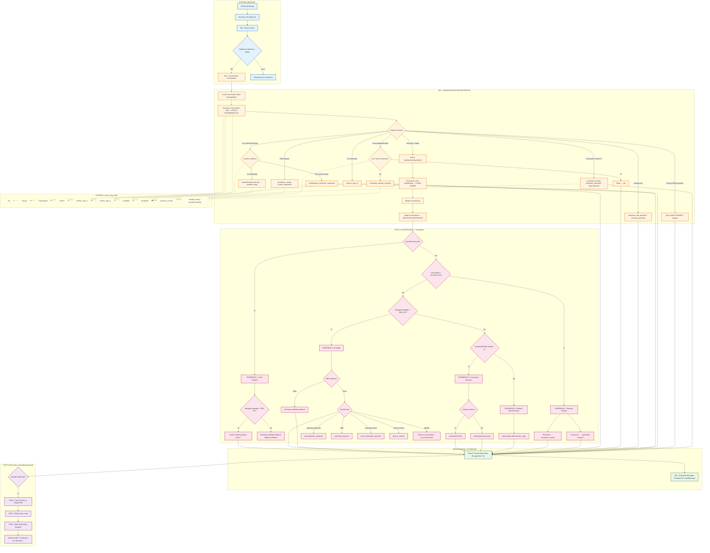
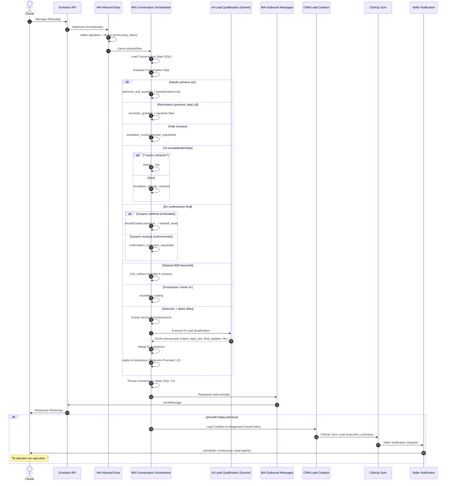
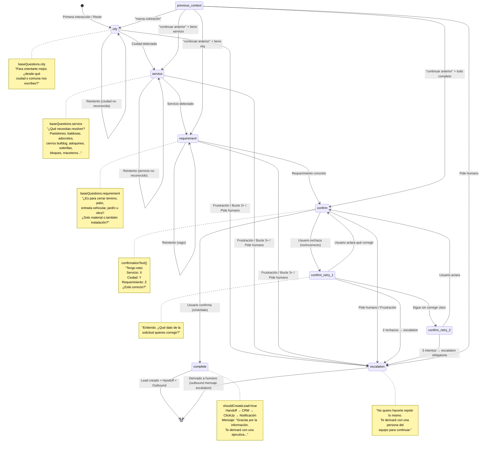
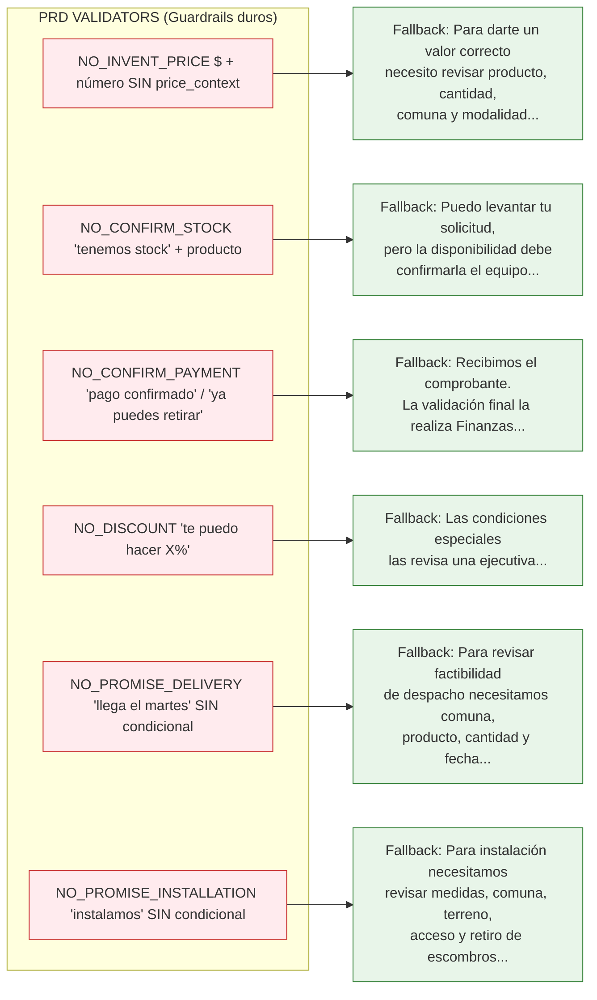
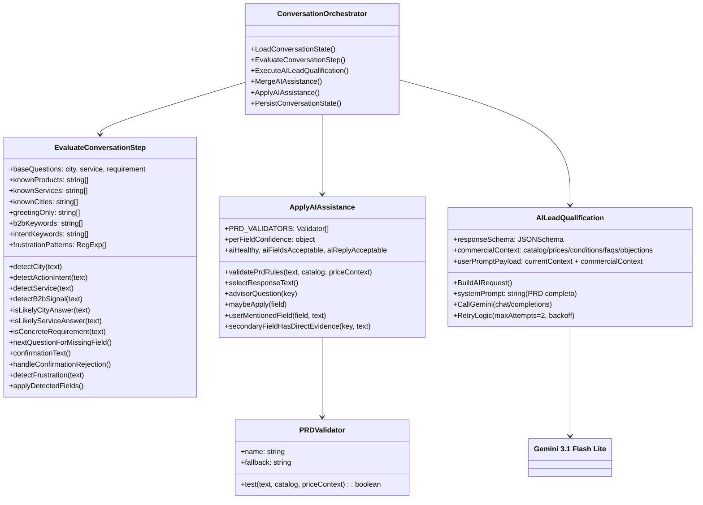
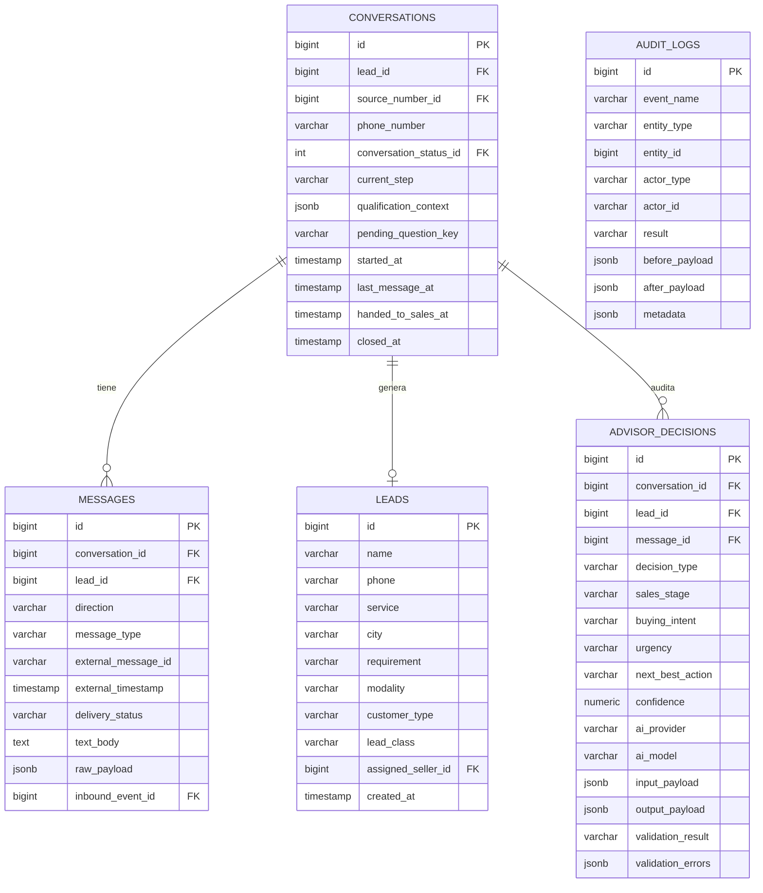

```mermaid
flowchart TD
    subgraph MEMORIA["MEMORIA ESTRUCTURADA (NO texto libre)"]
        QC[qualification_context JSONB]
        PQ[pending_question_key]
        CS[current_step codificado]
        RM[recent_messages últimos 3-4]
    end
    
    QC --> Q1[name, product, commune, quantity]
    QC --> Q2[measurements, use_case, modality]
    QC --> Q3[urgency, desired_date, photos]
    QC --> Q4[terrain, truck_access, debris_removal]
    QC --> Q5[customer_type, company, company_rut]
    QC --> Q6[contact_name, contact_role, email]
    QC --> Q7[purchase_order, invoice_required]
    QC --> Q8[address, access_restrictions, reception_contact]
    QC --> Q9[sale_number, purchase_date, issue_description]
    QC --> Q10[payment_amount, payment_method, quote_number]
    QC --> Q11[diagnostic_datos, lead_class, objection_detected]
    QC --> Q12[executive_summary]
    
    PQ --> PK1[need, product, commune, modality]
    PQ --> PK2[quantity, measurements, use_case]
    PQ --> PK3[terrain, truck_access, debris_removal]
    PQ --> PK4[urgency, photos, customer_type]
    PQ --> PK5[company, company_rut, contact]
    PQ --> PK6[email, purchase_order, invoice]
    PQ --> PK7[address, desired_date, access_restrictions]
    PQ --> PK8[issue_description, payment_details]
    PQ --> PK9[final_confirmation, anything_else]
    
    CS --> ST1["city|{service,city,requirement}"]
    CS --> ST2["service_retry_1|{...}"]
    CS --> ST3["confirm_retry_2|{...}"]
    CS --> ST4["complete|{...}"]
    CS --> ST5["escalation|{...}"]
    
    RM --> R1["{role:user, content: '...'}"]
    RM --> R2["{role:assistant, content: '...'}"]
    
    subgraph INTERPRETACION_SI_NO["INTERPRETACIÓN CONTEXTUAL SÍ/NO"]
        BN[pending_question_key ∈ booleanByQuestion?]
        BN -->|Sí| SN["/^(si|sí|s|no|nop)$/.test(normalizedText)"]
        SN -->|Sí| UP["qualificationContext[campo] = true/false"]
        BN -->|No| IG[NO interpreta como confirmación global]
    end
    
    style QC fill:#e3f2fd,stroke:#1565c0
    style PQ fill:#fff3e0,stroke:#ef6c00
    style CS fill:#fce4ec,stroke:#c2185b
    style RM fill:#e8f5e9,stroke:#2e7d32
    style BN fill:#fffde7,stroke:#fbc02d
    style UP fill:#e8f5e9,stroke:#2e7d32
```

---

**Archivo guardado en**: `docs/diagrama-flujo-bot.md`

Para visualizar:
- **VS Code**: Extensión "Markdown Preview Mermaid Support" → `Ctrl+Shift+V`
- **GitHub/GitLab**: Renderiza nativo en `.md`
- **Mermaid Live Editor**: https://mermaid.live (copia-pega el contenido)
- **Obsidian/Notion**: Bloque mermaid nativo
